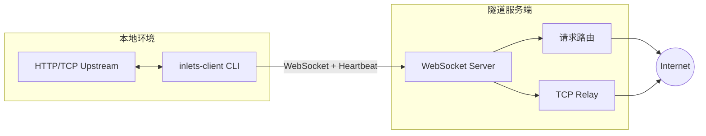

# Inlets Go Client

高可用 inlets 客户端的 Go 实现，负责与云端隧道服务通过 WebSocket 建立长连接，并把本地 HTTP/TCP 服务安全地暴露到公网。

## 架构示意



### 数据流

1. CLI 启动后与云端 WS 建立连接并完成签名鉴权（`token`/`credentials`/`public`）。
2. 连接成功后创建两条数据通道：
   - **HTTP**：服务端通过 WS 下发请求，客户端本地转发并回写响应。
   - **TCP**：服务端监听公网 TCP 端口，用户连接后再回拨客户端建立真正的数据流。
3. 客户端同时维护心跳（`ping/pong` + 服务端 `@@CONFIG` 动态下发）和自动重连，确保隧道稳定。

## 模块划分

```
internal/client/
├── client.go       // 连接管理、重连、消息分发
├── handlers.go     // HTTP/TCP 数据面逻辑
├── heartbeat.go    // 心跳与鉴权超时
├── types.go        // 配置与 DTO
└── utils.go        // HMAC、地址工具
```

## 功能特性

- HTTP & TCP 双隧道
- Token / Credentials / Public 三种鉴权
- 自动重连、心跳保活、防漂移超时
- TCP 端到端 HMAC 验证
- IPv4/IPv6 兼容的 `net.JoinHostPort` 地址拼装
- 协议版本协商支持（2.0.0+ 支持新协议，自动降级兼容旧协议）

## 构建

```bash
cd packages/inlets/go
go build -o inlets-client main.go
```

或使用 Makefile：

```bash
make build
```

## 命令行使用

### HTTP 隧道

```bash
# 公网 HTTP 隧道（public 模式）
./inlets-client http 127.0.0.1:9000

# 制定子域 + token
./inlets-client http 127.0.0.1:9000 -s myapp -t token
```

### TCP 隧道

```bash
# 使用 token
./inlets-client tcp 127.0.0.1:22 -p 20100 -t token

# 使用 credentials
./inlets-client tcp 127.0.0.1:22 --credentials clientId:clientSecret
```

### 查看版本信息

```bash
# 打印客户端版本信息
./inlets-client --version
# 或
./inlets-client -v
```

### 协议版本

```bash
# 使用最新协议版本（默认 v2，支持能力协商）
./inlets-client http 127.0.0.1:9000

# 使用旧协议版本（legacy 模式，v1）
./inlets-client http 127.0.0.1:9000 --legacy
```

**协议版本说明：**
- **默认（v2 / 2.0.0）**：支持新协议，客户端会发送 capabilities 进行能力协商，服务端返回协商后的协议配置
- **Legacy（v1 / 1.2.0）**：使用旧协议（legacy protocol），不发送 capabilities，完全兼容旧版本服务端

## 常用参数

| 参数 | 说明 | 默认值 |
| --- | --- | --- |
| `type` | 隧道类型 `http` / `tcp` | 必填 |
| `upstream` | 本地 upstream，端口或 `host:port` | 必填 |
| `-s, --sub-domain` | HTTP 自定义子域 | |
| `-p, --port` | TCP tunnel 端口 | |
| `-t, --token` | Token 鉴权 | |
| `--credentials` | `clientId:clientSecret` | |
| `-r, --remote` | 服务端地址 | `inlets.zcorky.com:443` |
| `--remote-tcp-port` | 服务端 TCP 回拨端口 | `8443` |
| `--healthcheck-interval` | 鉴权超时 / 健康检查间隔 (ms) | `30000` |
| `--legacy` | 使用旧协议版本（v1） | `false`（默认使用 v2） |
| `-v, --version` | 打印客户端版本信息并退出 | |

环境变量：

所有参数都支持通过环境变量配置，环境变量优先级低于命令行参数：

- `TUNNEL_PORT`：TCP tunnel 端口
- `SUB_DOMAIN`：HTTP 自定义子域
- `TOKEN`：Token 鉴权
- `CREDENTIALS`：Authentication credentials (clientId:clientSecret)
- `REMOTE`：服务端地址（默认：`inlets.zcorky.com:443`）
- `REMOTE_TCP_PORT`：服务端 TCP 回拨端口（默认：`8443`）
- `HEALTHCHECK_INTERVAL`：健康检查间隔（ms，默认：`30000`）
- `REPORT_URL`：异常汇报 webhook
- `LEGACY`：使用旧协议版本（设置为 `true`、`1` 或 `yes` 时启用）

## 示例

```bash
# 开发环境连接本地 server
./inlets-client http 127.0.0.1:9000 -r 127.0.0.1:8080

# 生产 SSH 隧道
./inlets-client tcp 127.0.0.1:22 --credentials prod:secret
```

