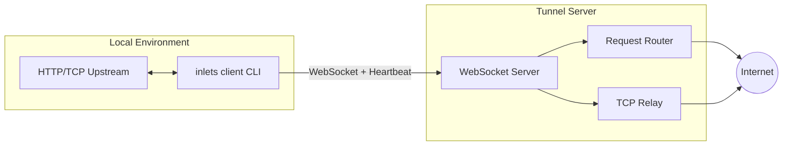

# Inlets Go

A high-availability Go implementation of the inlets tunnel system, including both client and server components. It establishes long-lived WebSocket connections to securely expose local HTTP/TCP services to the public internet.

**Documentation site:** the VitePress project under [`docs/`](./docs/) (`pnpm install && pnpm dev` inside that folder).

## Architecture



### Data Flow

1. After the CLI starts, it establishes a connection with the cloud WebSocket server and completes signature authentication (`token`/`credentials`/`public`).
2. After a successful connection, two data channels are created:
   - **HTTP**: The server sends requests through WebSocket, and the client forwards them locally and writes back responses.
   - **TCP**: The server listens on a public TCP port, and after a user connects, it calls back to the client to establish the actual data stream.
3. The client maintains heartbeat (`ping/pong` + server `@@CONFIG` dynamic delivery) and automatic reconnection to ensure tunnel stability.

## Module Structure

```
internal/client/
├── client.go       // Connection management, reconnection, message distribution
├── handlers.go     // HTTP/TCP data plane logic
├── heartbeat.go    // Heartbeat and authentication timeout
├── types.go        // Configuration and DTOs
└── utils.go        // HMAC, address utilities

internal/server/
├── server.go       // Server main logic
├── protocol/       // Protocol handling (new/legacy protocol adapter)
├── channels/       // Data channel management
├── tunnel/         // Tunnel handling (HTTP/TCP)
└── ...
```

## Features

- HTTP & TCP dual tunneling
- Three authentication methods: Token / Credentials / Public
- Automatic reconnection, heartbeat keepalive, drift timeout prevention
- End-to-end TCP HMAC verification
- IPv4/IPv6 compatible `net.JoinHostPort` address assembly
- Protocol version negotiation support (2.0.0+ supports new protocol, auto-downgrade for legacy compatibility)
- Server supports hot-reload configuration files
- Server supports bandwidth limiting
- Server supports multiple notification methods (DingTalk, Feishu, WeCom, Slack)

## Stability Update (2026-03)

To address cases where some HTTPS requests stayed pending under higher concurrency, the following fixes are now in place:

- **Callback race fix**: HTTP tunnel now registers response callbacks before sending requests, preventing lost fast responses.
- **Request timeout fallback**: Server-side tunnel requests now have a timeout guard and return `504 Gateway Timeout` instead of hanging indefinitely.
- **Atomic callback consumption**: Added `Take(tcpId, requestId)` semantics to fetch-and-remove callbacks in one step.
- **Client HTTP response parsing fix**: Client no longer waits for EOF to finish a response; it now parses responses via HTTP protocol semantics, which works with keep-alive upstreams.

New tests added for this change:

- `internal/server/container/callback_test.go`
- `internal/server/channels/monitor/auth_test.go`
- `internal/server/tunnel/http_test.go`

## Building

```bash
# Build the complete program (includes client, server, forward commands)
go build -o inlets ./cmd/inlets

# Or specify the full path
go build -o inlets cmd/inlets/inlets.go
```

## Command Line Usage

### Client

#### HTTP Tunnel

```bash
# Public HTTP tunnel (public mode; control plane unauthenticated: session may be time-limited by server)
inlets client http 127.0.0.1:9000

# Specify subdomain + token
inlets client --sub-domain myapp -t token http 127.0.0.1:9000
```

**Public monitor session:** If you do not pass `--token` or `--credentials`, the server classifies the client as a “public” (temporary) control-plane user and may close the WebSocket after a default period (e.g. 10 minutes, configurable in server YAML as `publicHTTPNoAuth`). This is independent of HTTP tunnel or public-URL (edge) auth. See `docs/features/PUBLIC_MONITOR_SESSION.md`.

#### TCP Tunnel

```bash
# Using token
inlets client -t token tcp -p 20100 127.0.0.1:22

# Using credentials
inlets client --credentials clientId:clientSecret tcp -p 20100 127.0.0.1:22
```

#### Version Information

```bash
# Print version information
inlets --version
# or
inlets -V
```

#### Protocol Version

```bash
# Use latest protocol version (default v2, supports capability negotiation)
inlets client --server https://tunnel.example.com http 127.0.0.1:9000

# Use legacy protocol version (legacy mode, v1)
inlets client --legacy --remote tunnel.example.com:443 http 127.0.0.1:9000
```

**Protocol Version Notes:**
- **Default (v2 / 2.0.0)**: Use `--server` (HTTP/HTTPS URL). The client sends capabilities for negotiation and expects the v2 monitor endpoint.
- **Legacy (v1 / 1.2.0)**: Use `--legacy` with `--remote` and `--remote-tcp-port`. This mode is compatible with older server versions.

#### Client Common Parameters

| Parameter | Description | Default |
| --- | --- | --- |
| `type` | Tunnel type `http` / `tcp` | Required |
| `upstream` | Local upstream, port or `host:port` | Required |
| `--sub-domain` | HTTP custom subdomain (http subcommand only) | |
| `-p, --port` | Public TCP port on the server (`tcp` subcommand only; env: `INLETS_TUNNEL_PORT`) | |
| `-t, --token` | Token authentication | |
| `--credentials` | `clientId:clientSecret` | |
| `--client-id` / `--client-secret` | Client credential auth (use both); overrides `--credentials` (env: `INLETS_CLIENT_ID`, `INLETS_CLIENT_SECRET`) | |
| `--server` | v2 server URL (`http://` or `https://`, optional path) | `https://inlets.zcorky.com` |
| `-r, --remote` | Legacy server address (`host:port`) | `inlets.zcorky.com:443` |
| `--remote-tcp-port` | Legacy server TCP callback port | `8443` |
| `--healthcheck-interval` | Authentication timeout / health check interval (ms) | `30000` |
| `--legacy` | Use legacy protocol version (v1) | `false` (default v2) |
| `--report-url` | Error report webhook | |

**Client Environment Variables:**

All client flags can be set via environment variables using the `INLETS_` prefix. These have lower priority than command-line arguments:

- `INLETS_TUNNEL_PORT`: Public TCP port on the server (used with the `tcp` subcommand)
- `INLETS_SUB_DOMAIN`: HTTP custom subdomain
- `INLETS_UPSTREAM_HTTP_USERNAME` / `INLETS_UPSTREAM_HTTP_PASSWORD`: Local upstream Basic auth (with the `http` subcommand)
- `INLETS_TOKEN`: Token authentication
- `INLETS_CREDENTIALS`: Authentication credentials (clientId:clientSecret)
- `INLETS_CLIENT_ID` / `INLETS_CLIENT_SECRET`: Same as `--client-id` and `--client-secret` (when both are set, they take precedence over `INLETS_CREDENTIALS`)
- `INLETS_SERVER`: v2 server URL (default: `https://inlets.zcorky.com`)
- `INLETS_REMOTE`: Legacy server address (default: `inlets.zcorky.com:443`)
- `INLETS_REMOTE_TCP_PORT`: Legacy server TCP callback port (default: `8443`)
- `INLETS_HEALTHCHECK_INTERVAL`: Health check interval (ms, default: `30000`)
- `INLETS_REPORT_URL`: Error report webhook
- `INLETS_LEGACY`: Use legacy protocol version (set to `true`, `1`, or `yes` to enable)

### Server

```bash
# Start server (domain required)
inlets server -d example.com -t your-token

# Use config file
inlets server -c /path/to/config.yml

# Specify ports
inlets server -d example.com -p 8080 --tcp-port 8443

# Disable HTTPS (enabled by default)
inlets server -d example.com -t your-token --secure=false
```

#### Server Common Parameters

| Parameter | Description | Default |
| --- | --- | --- |
| `-d, --domain` | Server domain (required) | |
| `-p, --port` | WebSocket service port | `8080` |
| `--tcp-port` | TCP service port | `8443` |
| `-s, --secure` | Enable HTTPS (only for URL) | `true` |
| `-t, --token` | Authentication token | |
| `-c, --config` | Config file path | `$HOME/.config/inlets.yml` |
| `--notification-provider` | Notification provider (dingtalk, feishu, wecom, slack) | |
| `--notification-url` | Notification webhook URL | |

**Server Environment Variables:**

Server flags use the `INLETS_` prefix:

- `INLETS_DOMAIN`: Server domain
- `INLETS_SERVER_PORT`: WebSocket service port (default: `8080`)
- `INLETS_SERVER_TCP_PORT`: TCP service port (default: `8443`)
- `INLETS_SECURE`: Enable HTTPS (default: `true`)
- `INLETS_NOTIFICATION_PROVIDER`: Notification provider
- `INLETS_NOTIFICATION_URL`: Notification webhook URL

#### Server Configuration File

The server supports YAML configuration files. The default path is `$HOME/.config/inlets.yml`, and it supports hot-reload.

Configuration file example:

```yaml
domain: example.com
port: 8080
tcpPort: 8443
secure: true
token: your-token

clients:
  - clientId: client1
    clientSecret: secret1
    config:
      version: "2.0.0"
    bandwidthLimit:
      upload: 1024000    # 1MB/s
      download: 1024000  # 1MB/s

bandwidthLimits:
  global:
    upload: 512000      # 512KB/s
    download: 512000    # 512KB/s
  clients:
    client1:
      upload: 1024000
      download: 1024000

notification:
  provider: dingtalk
  url: https://oapi.dingtalk.com/robot/send?access_token=xxx
```

### Forward

```bash
# TCP port forwarding
inlets forward -s 0.0.0.0:8080 -t 127.0.0.1:3000
```

## Examples

### Client Examples

```bash
# Development environment connecting to local server
inlets client --server http://127.0.0.1:8080 http 127.0.0.1:9000

# v2 server URL with base path prefix
inlets client --server https://tunnel.example.com/base http --sub-domain myapp 127.0.0.1:9000

# Production SSH tunnel
inlets client --credentials prod:secret tcp -p 20100 127.0.0.1:22

# HTTP tunnel with custom subdomain
inlets client --sub-domain myapp -t token http 127.0.0.1:9000

# Legacy mode example
inlets client --legacy --remote tunnel.example.com:443 --remote-tcp-port 8443 http 127.0.0.1:9000
```

### Server Examples

```bash
# Basic startup
inlets server -d tunnel.example.com -t your-secret-token

# Using config file
inlets server -c /etc/inlets/config.yml

# Custom ports
inlets server -d tunnel.example.com -t token -p 9000 --tcp-port 9443
```
