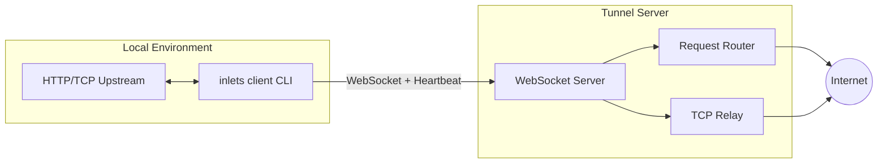

# Inlets Go

A high-availability Go implementation of the inlets tunnel system, including both client and server components. It establishes long-lived WebSocket connections to securely expose local HTTP/TCP services to the public internet.

## Architecture



### Data Flow

1. After the CLI starts, it establishes a connection with the cloud WebSocket server and completes signature authentication (`token`/`credentials`/`public`).
2. After a successful connection, two data channels are created:
   - **HTTP**: The server sends requests through WebSocket, and the client forwards them locally and writes back responses.
   - **TCP**: The server listens on a public TCP port, and after a user connects, it calls back to the client to establish the actual data stream.
3. The client maintains heartbeat (`ping/pong` + server `@@CONFIG` dynamic delivery) and automatic reconnection to ensure tunnel stability.

## Module Structure

```
internal/client/
├── client.go       // Connection management, reconnection, message distribution
├── handlers.go     // HTTP/TCP data plane logic
├── heartbeat.go    // Heartbeat and authentication timeout
├── types.go        // Configuration and DTOs
└── utils.go        // HMAC, address utilities

internal/server/
├── server.go       // Server main logic
├── protocol/       // Protocol handling (new/legacy protocol adapter)
├── channels/       // Data channel management
├── tunnel/         // Tunnel handling (HTTP/TCP)
└── ...
```

## Features

- HTTP & TCP dual tunneling
- Three authentication methods: Token / Credentials / Public
- Automatic reconnection, heartbeat keepalive, drift timeout prevention
- End-to-end TCP HMAC verification
- IPv4/IPv6 compatible `net.JoinHostPort` address assembly
- Protocol version negotiation support (2.0.0+ supports new protocol, auto-downgrade for legacy compatibility)
- Server supports hot-reload configuration files
- Server supports bandwidth limiting
- Server supports multiple notification methods (DingTalk, Feishu, WeCom, Slack)

## Building

```bash
# Build the complete program (includes client, server, forward commands)
go build -o inlets ./cmd/inlets

# Or specify the full path
go build -o inlets cmd/inlets/inlets.go
```

## Command Line Usage

### Client

#### HTTP Tunnel

```bash
# Public HTTP tunnel (public mode)
inlets client http 127.0.0.1:9000

# Specify subdomain + token
inlets client -s myapp -t token http 127.0.0.1:9000
```

#### TCP Tunnel

```bash
# Using token
inlets client -p 20100 -t token tcp 127.0.0.1:22

# Using credentials
inlets client --credentials clientId:clientSecret -p 20100 tcp 127.0.0.1:22
```

#### Version Information

```bash
# Print version information
inlets --version
# or
inlets -V
```

#### Protocol Version

```bash
# Use latest protocol version (default v2, supports capability negotiation)
inlets client http 127.0.0.1:9000

# Use legacy protocol version (legacy mode, v1)
inlets client --legacy http 127.0.0.1:9000
```

**Protocol Version Notes:**
- **Default (v2 / 2.0.0)**: Supports new protocol, client sends capabilities for negotiation, server returns negotiated protocol configuration
- **Legacy (v1 / 1.2.0)**: Uses legacy protocol, doesn't send capabilities, fully compatible with older server versions

#### Client Common Parameters

| Parameter | Description | Default |
| --- | --- | --- |
| `type` | Tunnel type `http` / `tcp` | Required |
| `upstream` | Local upstream, port or `host:port` | Required |
| `-s, --sub-domain` | HTTP custom subdomain | |
| `-p, --port` | TCP tunnel port | |
| `-t, --token` | Token authentication | |
| `--credentials` | `clientId:clientSecret` | |
| `-r, --remote` | Server address | `inlets.zcorky.com:443` |
| `--remote-tcp-port` | Server TCP callback port | `8443` |
| `--healthcheck-interval` | Authentication timeout / health check interval (ms) | `30000` |
| `--legacy` | Use legacy protocol version (v1) | `false` (default v2) |
| `--report-url` | Error report webhook | |

**Client Environment Variables:**

All parameters can be configured via environment variables. Environment variables have lower priority than command-line arguments:

- `TUNNEL_PORT`: TCP tunnel port
- `SUB_DOMAIN`: HTTP custom subdomain
- `TOKEN`: Token authentication
- `CREDENTIALS`: Authentication credentials (clientId:clientSecret)
- `REMOTE`: Server address (default: `inlets.zcorky.com:443`)
- `REMOTE_TCP_PORT`: Server TCP callback port (default: `8443`)
- `HEALTHCHECK_INTERVAL`: Health check interval (ms, default: `30000`)
- `REPORT_URL`: Error report webhook
- `LEGACY`: Use legacy protocol version (set to `true`, `1`, or `yes` to enable)

### Server

```bash
# Start server (domain required)
inlets server -d example.com -t your-token

# Use config file
inlets server -c /path/to/config.yml

# Specify ports
inlets server -d example.com -p 8080 --tcp-port 8443

# Disable HTTPS (enabled by default)
inlets server -d example.com -t your-token --secure=false
```

#### Server Common Parameters

| Parameter | Description | Default |
| --- | --- | --- |
| `-d, --domain` | Server domain (required) | |
| `-p, --port` | WebSocket service port | `8080` |
| `--tcp-port` | TCP service port | `8443` |
| `-s, --secure` | Enable HTTPS (only for URL) | `true` |
| `-t, --token` | Authentication token | |
| `-c, --config` | Config file path | `$HOME/.config/inlets.yml` |
| `--notification-provider` | Notification provider (dingtalk, feishu, wecom, slack) | |
| `--notification-url` | Notification webhook URL | |

**Server Environment Variables:**

- `DOMAIN`: Server domain
- `SERVER_PORT`: WebSocket service port (default: `8080`)
- `SERVER_TCP_PORT`: TCP service port (default: `8443`)
- `SECURE`: Enable HTTPS (default: `true`)
- `TOKEN`: Authentication token
- `NOTIFICATION_PROVIDER`: Notification provider
- `NOTIFICATION_URL`: Notification webhook URL

#### Server Configuration File

The server supports YAML configuration files. The default path is `$HOME/.config/inlets.yml`, and it supports hot-reload.

Configuration file example:

```yaml
domain: example.com
port: 8080
tcpPort: 8443
secure: true
token: your-token

clients:
  - clientId: client1
    clientSecret: secret1
    config:
      version: "2.0.0"
    bandwidthLimit:
      upload: 1024000    # 1MB/s
      download: 1024000  # 1MB/s

bandwidthLimits:
  global:
    upload: 512000      # 512KB/s
    download: 512000    # 512KB/s
  clients:
    client1:
      upload: 1024000
      download: 1024000

notification:
  provider: dingtalk
  url: https://oapi.dingtalk.com/robot/send?access_token=xxx
```

### Forward

```bash
# TCP port forwarding
inlets forward -s 0.0.0.0:8080 -t 127.0.0.1:3000
```

## Examples

### Client Examples

```bash
# Development environment connecting to local server
inlets client -r 127.0.0.1:8080 http 127.0.0.1:9000

# Production SSH tunnel
inlets client --credentials prod:secret -p 20100 tcp 127.0.0.1:22

# HTTP tunnel with custom subdomain
inlets client -s myapp -t token http 127.0.0.1:9000
```

### Server Examples

```bash
# Basic startup
inlets server -d tunnel.example.com -t your-secret-token

# Using config file
inlets server -c /etc/inlets/config.yml

# Custom ports
inlets server -d tunnel.example.com -t token -p 9000 --tcp-port 9443
```
