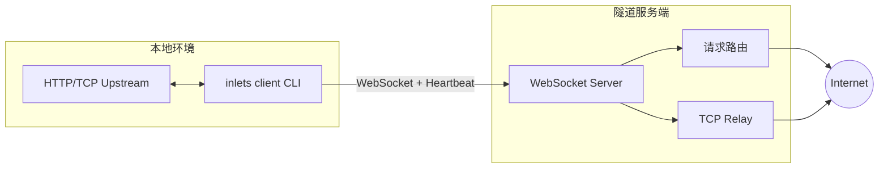

# Inlets Go

高可用 inlets 隧道系统的 Go 实现，包含客户端和服务端，负责通过 WebSocket 建立长连接，把本地 HTTP/TCP 服务安全地暴露到公网。

## 架构示意



### 数据流

1. CLI 启动后与云端 WS 建立连接并完成签名鉴权（`token`/`credentials`/`public`）。
2. 连接成功后创建两条数据通道：
   - **HTTP**：服务端通过 WS 下发请求，客户端本地转发并回写响应。
   - **TCP**：服务端监听公网 TCP 端口，用户连接后再回拨客户端建立真正的数据流。
3. 客户端同时维护心跳（`ping/pong` + 服务端 `@@CONFIG` 动态下发）和自动重连，确保隧道稳定。

## 模块划分

```
internal/client/
├── client.go       // 连接管理、重连、消息分发
├── handlers.go     // HTTP/TCP 数据面逻辑
├── heartbeat.go    // 心跳与鉴权超时
├── types.go        // 配置与 DTO
└── utils.go        // HMAC、地址工具

internal/server/
├── server.go       // 服务端主逻辑
├── protocol/       // 协议处理（新/旧协议适配）
├── channels/       // 数据通道管理
├── tunnel/         // 隧道处理（HTTP/TCP）
└── ...
```

## 功能特性

- HTTP & TCP 双隧道
- Token / Credentials / Public 三种鉴权
- 自动重连、心跳保活、防漂移超时
- TCP 端到端 HMAC 验证
- IPv4/IPv6 兼容的 `net.JoinHostPort` 地址拼装
- 协议版本协商支持（2.0.0+ 支持新协议，自动降级兼容旧协议）
- 服务端支持配置文件热重载
- 服务端支持带宽限制
- 服务端支持多种通知方式（钉钉、飞书、企业微信、Slack）

## 稳定性更新（2026-03）

针对“HTTPS 并发升高时部分请求长期 pending”的场景，已完成以下修复：

- **修复回调竞态**：服务端 HTTP 隧道改为“先注册回调，再发送请求”，避免响应先到导致回调丢失。
- **增加请求超时兜底**：服务端为隧道请求增加超时保护，超时时返回 `504 Gateway Timeout`，避免无限 pending。
- **优化回调消费语义**：新增 `Take(tcpId, requestId)` 原子取出并删除回调，防止重复触发和回调残留。
- **修复客户端响应读取**：客户端不再依赖“读到 EOF”判断响应结束，改为按 HTTP 协议解析响应，兼容 keep-alive 场景。

本次新增测试用例：

- `internal/server/container/callback_test.go`
- `internal/server/channels/monitor/auth_test.go`
- `internal/server/tunnel/http_test.go`

## 构建

```bash
# 构建完整程序（包含 client、server、forward 命令）
go build -o inlets ./cmd/inlets

# 或指定完整路径
go build -o inlets cmd/inlets/inlets.go
```

## 命令行使用

### 客户端（Client）

#### HTTP 隧道

```bash
# 公网 HTTP 隧道（public 模式）
inlets client http 127.0.0.1:9000

# 指定子域 + token
inlets client -s myapp -t token http 127.0.0.1:9000
```

#### TCP 隧道

```bash
# 使用 token
inlets client -t token tcp -p 20100 127.0.0.1:22

# 使用 credentials
inlets client --credentials clientId:clientSecret tcp -p 20100 127.0.0.1:22
```

#### 查看版本信息

```bash
# 打印版本信息
inlets --version
# 或
inlets -V
```

#### 协议版本

```bash
# 使用最新协议版本（默认 v2，支持能力协商）
inlets client http 127.0.0.1:9000

# 使用旧协议版本（legacy 模式，v1）
inlets client --legacy http 127.0.0.1:9000
```

**协议版本说明：**
- **默认（v2 / 2.0.0）**：支持新协议，客户端会发送 capabilities 进行能力协商，服务端返回协商后的协议配置
- **Legacy（v1 / 1.2.0）**：使用旧协议（legacy protocol），不发送 capabilities，完全兼容旧版本服务端

#### 客户端常用参数

| 参数 | 说明 | 默认值 |
| --- | --- | --- |
| `type` | 隧道类型 `http` / `tcp` | 必填 |
| `upstream` | 本地 upstream，端口或 `host:port` | 必填 |
| `-s, --sub-domain` | HTTP 自定义子域 | |
| `-p, --port` | 服务端公网 TCP 端口（仅 `tcp` 子命令；环境变量 `TUNNEL_PORT`） | |
| `-t, --token` | Token 鉴权 | |
| `--credentials` | `clientId:clientSecret` | |
| `--client-id` / `--client-secret` | 凭证鉴权（须同时设置）；优先于 `--credentials`（环境变量 `CLIENT_ID` / `CLIENT_SECRET`） | |
| `-r, --remote` | 服务端地址 | `inlets.zcorky.com:443` |
| `--remote-tcp-port` | 服务端 TCP 回拨端口 | `8443` |
| `--healthcheck-interval` | 鉴权超时 / 健康检查间隔 (ms) | `30000` |
| `--legacy` | 使用旧协议版本（v1） | `false`（默认使用 v2） |
| `--report-url` | 异常汇报 webhook | |

**客户端环境变量：**

所有参数都支持通过环境变量配置，环境变量优先级低于命令行参数：

- `TUNNEL_PORT`：服务端公网 TCP 端口（与 `tcp` 子命令一起使用）
- `SUB_DOMAIN`：HTTP 自定义子域
- `TOKEN`：Token 鉴权
- `CREDENTIALS`：Authentication credentials (clientId:clientSecret)
- `CLIENT_ID` / `CLIENT_SECRET`：与 `--client-id`、`--client-secret` 相同；两者都设置时优先于 `CREDENTIALS`
- `REMOTE`：服务端地址（默认：`inlets.zcorky.com:443`）
- `REMOTE_TCP_PORT`：服务端 TCP 回拨端口（默认：`8443`）
- `HEALTHCHECK_INTERVAL`：健康检查间隔（ms，默认：`30000`）
- `REPORT_URL`：异常汇报 webhook
- `LEGACY`：使用旧协议版本（设置为 `true`、`1` 或 `yes` 时启用）

### 服务端（Server）

```bash
# 启动服务端（需要指定 domain）
inlets server -d example.com -t your-token

# 使用配置文件
inlets server -c /path/to/config.yml

# 指定端口
inlets server -d example.com -p 8080 --tcp-port 8443

# 禁用 HTTPS（默认启用）
inlets server -d example.com -t your-token --secure=false
```

#### 服务端常用参数

| 参数 | 说明 | 默认值 |
| --- | --- | --- |
| `-d, --domain` | 服务端域名（必填） | |
| `-p, --port` | WebSocket 服务端口 | `8080` |
| `--tcp-port` | TCP 服务端口 | `8443` |
| `-s, --secure` | 启用 HTTPS（仅用于 URL） | `true` |
| `-t, --token` | 认证 Token | |
| `-c, --config` | 配置文件路径 | `$HOME/.config/inlets.yml` |
| `--notification-provider` | 通知提供商（dingtalk, feishu, wecom, slack） | |
| `--notification-url` | 通知 webhook URL | |

**服务端环境变量：**

- `DOMAIN`：服务端域名
- `SERVER_PORT`：WebSocket 服务端口（默认：`8080`）
- `SERVER_TCP_PORT`：TCP 服务端口（默认：`8443`）
- `SECURE`：启用 HTTPS（默认：`true`）
- `TOKEN`：认证 Token
- `NOTIFICATION_PROVIDER`：通知提供商
- `NOTIFICATION_URL`：通知 webhook URL

#### 服务端配置文件

服务端支持 YAML 配置文件，默认路径为 `$HOME/.config/inlets.yml`，支持热重载。

配置文件示例：

```yaml
domain: example.com
port: 8080
tcpPort: 8443
secure: true
token: your-token

clients:
  - clientId: client1
    clientSecret: secret1
    config:
      version: "2.0.0"
    bandwidthLimit:
      upload: 1024000    # 1MB/s
      download: 1024000  # 1MB/s

bandwidthLimits:
  global:
    upload: 512000      # 512KB/s
    download: 512000    # 512KB/s
  clients:
    client1:
      upload: 1024000
      download: 1024000

notification:
  provider: dingtalk
  url: https://oapi.dingtalk.com/robot/send?access_token=xxx
```

### 转发（Forward）

```bash
# TCP 端口转发
inlets forward -s 0.0.0.0:8080 -t 127.0.0.1:3000
```

## 示例

### 客户端示例

```bash
# 开发环境连接本地 server
inlets client -r 127.0.0.1:8080 http 127.0.0.1:9000

# 生产 SSH 隧道
inlets client --credentials prod:secret tcp -p 20100 127.0.0.1:22

# HTTP 隧道带自定义子域
inlets client -s myapp -t token http 127.0.0.1:9000
```

### 服务端示例

```bash
# 基础启动
inlets server -d tunnel.example.com -t your-secret-token

# 使用配置文件
inlets server -c /etc/inlets/config.yml

# 自定义端口
inlets server -d tunnel.example.com -t token -p 9000 --tcp-port 9443
```
