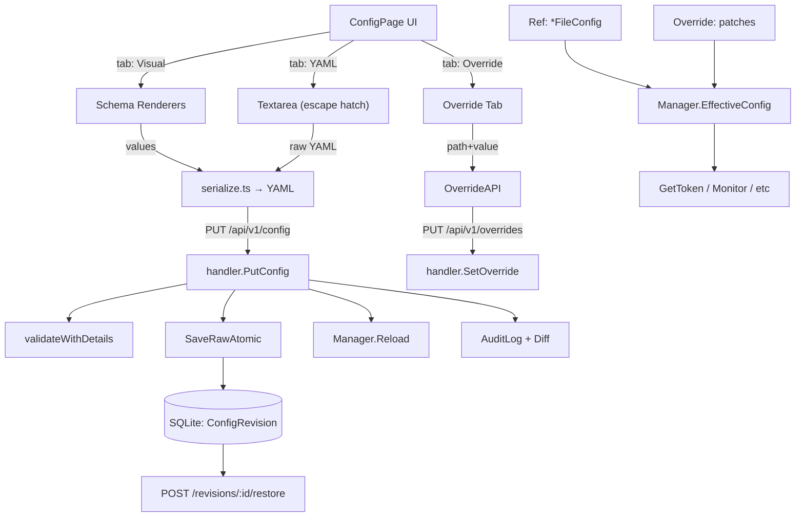

# Admin Config Visualization

The Admin console now ships a structured configuration editor that replaces the raw YAML textarea with field-typed controls, live validation, save-time diff review, historical revision rollback, and a runtime override layer for temporary changes.

## Goals

- **Structured form** editing for `FileConfig`, instead of editing YAML by hand.
- **Live validation** as fields are touched; errors are surfaced with field paths (e.g. `clients[2].clientSecret`).
- **Diff preview** before save and a **revision history** with rollback.
- **Runtime override layer** for in-process, non-persistent changes (e.g. temporarily raise a client's bandwidth).
- **Session ↔ config match** view that tells operators which YAML entry each online tunnel maps to.

## Architecture

## API

All endpoints live under `/api/v1`. Errors are returned as `{"ok": false, "error": "..."}`.

| Method | Path | Purpose |
|---|---|---|
| GET    | `/config`                       | Returns parsed `FileConfig`. `?maskSecrets=false` to include secrets. |
| GET    | `/config/raw`                   | Returns the on-disk YAML. |
| GET    | `/config/schema`                | Returns UI schema groups & fields. |
| POST   | `/config/validate`              | `{"yaml": "..."}` → `{ok, errors[]}` (no write). |
| PUT    | `/config`                       | `{"yaml", "summary"}` → writes, persists revision, audits diff, reloads. |
| GET    | `/config/revisions`             | Most recent revisions, newest first. |
| GET    | `/config/revisions/:id`         | One revision (includes full YAML). |
| POST   | `/config/revisions/:id/restore` | Restores a revision; creates a new revision that records the lineage. |
| GET    | `/overrides`                    | Active override patches. |
| PUT    | `/overrides`                    | `{"path", "value"}` → sets a runtime override. |
| DELETE | `/overrides/clear-all`          | Wipes all runtime overrides. |
| DELETE | `/overrides/{path}`             | Removes one runtime override. |

## Structured form (PR-1)

- `internal/server/config/validate.go` exposes `ValidationError {Path, Message}` and a `ValidateWithDetails(*FileConfig) []ValidationError` function. The legacy `Validate` is preserved (now `errors.Join` of the structured errors).
- `internal/server/admin/handler/api.go` adds `POST /config/validate` and `GET /config/schema`.
- `internal/server/admin/service/schema.go` returns a static `ConfigSchema` description (groups + field definitions). It is **pure** (no file I/O), so it's trivially unit-tested.
- Front-end (`admin/src/schema/renderers.tsx`) renders typed controls: `string`, `int`, `port`, `bool`, `enum`, `duration`, `secret`, plus a `CardList` for arrays of clients and tunnels.
- `admin/src/schema/serialize.ts` roundtrips structured `values` to YAML. Comments are intentionally **not** preserved (YAML library limitation); an "escape hatch" YAML tab remains for users who need to keep comments.

### Secret handling

Secrets are masked on `GET /api/v1/config` by default. The admin UI uses `?maskSecrets=false` to fetch the full document and stores the unmasked values in a React `useRef` for the duration of the edit session. The form widget renders `***` for secret fields; on submit the original unmasked value is re-filled into the YAML before it is sent to the server. Emptying the field is treated as an explicit deletion.

### Pass-through for unknown fields

The schema does **not** enumerate every possible key in the YAML. When the structured form serializes its values back, fields that aren't in the schema are preserved from the source YAML verbatim. This keeps the editor working as new fields are added to the Go config without forcing a frontend release.

## Diff preview & history (PR-2)

- `AuditLog` gains a `Diff` column. `Audit.Record` accepts an optional diff string (`""` means none).
- A new `ConfigRevision` table stores append-only snapshots of the YAML. The most recent 200 are kept; older ones are trimmed by an opportunistic `cleanup()` after each save.
- `ConfigService.SaveRaw(in SaveRawInput) (*SaveRawResult, error)` writes the revision **first**, then atomically writes the file via `SaveRawAtomic`, then triggers `Manager.Reload`. If the file write fails, the orphan revision row is overwritten on the next save.
- `ConfigService.Restore(revID, in)` writes a new revision with `summary="restored from #N"` and audits the lineage (`{"fromId":N,"toId":M}` in the `Diff` column).
- The save flow in the UI shows a **diff modal** (red/green/gray per line) before committing, and the **Revisions panel** on the right shows the last 20 snapshots, each with a one-click restore (with a revert diff confirmation).

## Runtime override layer (PR-3)

- `internal/server/config/override.go` defines `Override { patches map[string]json.RawMessage }` with `Set/Get/Delete/ClearAll/List/Apply`.
- Patches are addressed by JSON-pointer-like paths: `clients[0].clientSecret`, `publicHTTPNoAuth.timeout`, `domain`, etc.
- `Set` validates that the path resolves against a zero-valued `FileConfig`; unknown paths fail-fast at API time, not at apply time.
- `Apply(base)` deep-copies `base` via JSON round-trip and writes the patches into the copy. The original `*FileConfig` is **never** mutated.
- `Manager.EffectiveConfig()` returns `override.Apply(ref.Get())`; the reload callback uses this to apply overrides without the cost of copying on every `Get`.
- The Status page shows a yellow banner whenever there is at least one active override. The Config page has a dedicated "Override" tab where patches can be added, listed, removed, or cleared in bulk.
- Concurrency: `Override` uses a `sync.RWMutex`. Tested under `-race` with concurrent `Set`/`Apply`/`Delete`/`ClearAll`.

## Sessions ↔ config match (PR-4)

- `SessionView` gains `ConfigIndex`, `ConfigMatch` (`exact`/`partial`/`missing`), and `MatchIssues`.
- `Monitor.matchSession` walks `cfg.Clients` to find the index whose `ClientID` matches `tm.ClientId`. Sessions with `anonymous-*` ids are reported as missing.
- The match column in the Sessions page is filterable (all / exact / partial / missing). Click on a row's config cell to see the issue text in a tooltip ("client secret in YAML is empty", "client id not in YAML", etc.).
- Secrets are never compared or displayed: only the **configured** secret is referenced. A session that successfully authenticated is reported as `exact`, even if the YAML was later edited.

## Risks & limitations

| Risk | Mitigation |
|---|---|
| YAML comments lost on round-trip | The "YAML 源" tab is preserved as an escape hatch for users who need to keep comments. |
| Override ↔ Ref concurrency | `Override.Apply` deep-copies the base; `*FileConfig` is never mutated. Tested under `-race`. |
| Revision table growth | Opportunistic `cleanup()` keeps ≤200 rows. Configurable via `admin.revisions.maxKeep`. |
| Accidentally changing a secret | Diff preview, type-to-confirm secret field, audit diff not stored when caller passes masked content. |
| New Go config fields without UI | Pass-through preserves unrecognized fields in the source YAML. |
| `SaveRaw` non-atomic between SQLite and file | Documented; failure window is between the two writes; the next save overwrites the orphan revision. |
