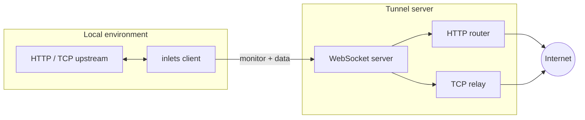

# Architecture

At a high level, the **client** runs beside your upstream service. The **server** terminates public HTTP/TCP and forwards traffic to the client over **WebSockets** (and related channels).

## Data flow

1. The client connects to the server and completes authentication (**token** / **credentials** / **public** monitor).
2. **HTTP**: the server forwards requests over the tunnel; the client proxies to the local upstream and returns the response.
3. **TCP**: the server accepts public connections and coordinates a stream to the client’s upstream dial.
4. **Heartbeat** and **@@CONFIG** (and related messages) keep the session healthy; the client reconnects on loss.

## Control plane vs data plane

- **Monitor channel** (`/_/monitor`): authentication, tunnel lifecycle, HTTP request/response envelopes in the classic path, and administrative messages.
- **Data channel** (`/_/data`, v2): binary-framed streaming for large or high-rate payloads when negotiated.

## Protocol versions

- **v2** negotiates **capabilities** (streaming, semantic HTTP head/body split, TCP over WebSocket, …).
- **Legacy v1** uses a different wire format and endpoints.

### TCP streams (v2)

**TCP over WebSocket** uses a per-stream **data channel** (`/_/data`) as well as **monitor** messages such as `tcp:connect`. Because those are separate WebSockets, an older client could receive the first user bytes before it finished handling `tcp:connect` and drop the opening chunk (breaking TLS/proxy handshakes).

Current clients negotiate **`TCPEarlyStreamRegister`**: they register stream state as soon as the data channel is open. The server skips an extra relay-setup delay when that bit is negotiated. Older v2 binaries that omit the bit are still supported: the server waits a short interval before starting the upload loop so the monitor path can process `tcp:connect` first (best-effort).

Tests: `internal/server/tunnel/tcp_relay_delay_test.go`, `internal/server/channels/monitor/capabilities_test.go`, `internal/client/capabilities_test.go`.

Implementation notes: [New protocol issues](/features/NEW_PROTOCOL_ISSUES).

## Code map (repository)

| Path | Role |
| --- | --- |
| `cmd/inlets/` | CLI entrypoints for client and server. |
| `internal/client/` | Connection management, HTTP/TCP handlers, heartbeat. |
| `internal/server/` | Server core, protocol adapters, channels, tunnels. |
| `internal/server/protocol/` | Binary and legacy protocol handling. |
| `internal/server/tunnel/` | HTTP and TCP tunnel implementations. |
