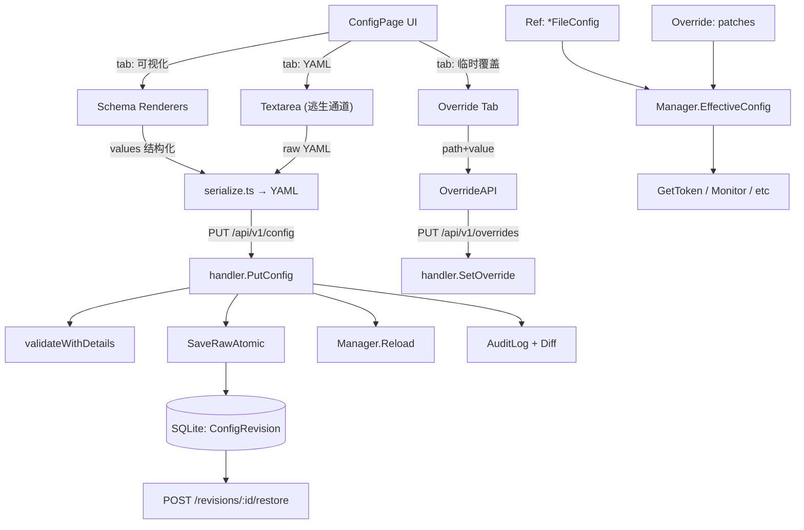

# Admin 配置管理可视化

Admin 控制台现在内置了结构化配置编辑器：替代手写 YAML 的 textarea，提供类型化控件、即时校验、保存前 Diff、历史版本回滚，以及用于临时调整的运行时覆盖层。

## 目标

- 以**结构化表单**编辑 `FileConfig`，不再直接手写 YAML。
- **即时校验**：字段失焦即触发；错误携带字段路径（如 `clients[2].clientSecret`）。
- **保存前 Diff** + **历史版本**与一键回滚。
- **运行时覆盖层**：进程内临时调整（如临时给某客户端升带宽），不写文件、不持久化。
- **会话 ↔ 配置匹配视图**：一眼看到在线隧道对应 YAML 第几个 client。

## 架构

## API

所有端点位于 `/api/v1`。错误统一为 `{"ok": false, "error": "..."}`。

| Method | Path | 用途 |
|---|---|---|
| GET    | `/config`                       | 解析后的 `FileConfig`；`?maskSecrets=false` 包含密钥。 |
| GET    | `/config/raw`                   | 磁盘上的 YAML。 |
| GET    | `/config/schema`                | UI schema groups & fields。 |
| POST   | `/config/validate`              | `{"yaml": "..."}` → `{ok, errors[]}`（仅校验、不写）。 |
| PUT    | `/config`                       | `{"yaml", "summary"}` → 写文件、写 revision、audit、reload。 |
| GET    | `/config/revisions`             | 最近的历史版本，按时间倒序。 |
| GET    | `/config/revisions/:id`         | 单条历史（含完整 YAML）。 |
| POST   | `/config/revisions/:id/restore` | 恢复到该版本，并写入一条新历史。 |
| GET    | `/overrides`                    | 当前生效的覆盖列表。 |
| PUT    | `/overrides`                    | `{"path", "value"}` → 设置一条覆盖。 |
| DELETE | `/overrides/clear-all`          | 清空所有覆盖。 |
| DELETE | `/overrides/{path}`             | 删除指定 path 的覆盖。 |

## 结构化表单（PR-1）

- `internal/server/config/validate.go` 暴露 `ValidationError {Path, Message}` 和 `ValidateWithDetails(*FileConfig) []ValidationError`。旧 `Validate` 保留，改为 `errors.Join` 的包装。
- `internal/server/admin/handler/api.go` 新增 `POST /config/validate` 与 `GET /config/schema`。
- `internal/server/admin/service/schema.go` 返回静态 `ConfigSchema` 描述（分组 + 字段定义），**纯函数**，不读文件，单测友好。
- 前端 `admin/src/schema/renderers.tsx` 提供类型化控件：`string` / `int` / `port` / `bool` / `enum` / `duration` / `secret`，外加 `CardList`（增删改 + 上下移）。
- `admin/src/schema/serialize.ts` 把结构化 `values` 序列化为等价 YAML，**有意识地不保留注释**（YAML 库限制）。需要保留注释的用户可走 "YAML 源" tab。

### 密钥处理

`GET /api/v1/config` 默认对密钥字段 mask。Admin UI 通过 `?maskSecrets=false` 拉全量文档，并把未 mask 的值暂存到 React `useRef`。表单渲染为 `***`；提交时由前端把原值填回 YAML 再发送。**主动清空 = 显式删除**。

### schema 之外的字段（pass-through）

schema 不会枚举 YAML 中所有可能出现的 key。结构化表单回写时，对 schema 未识别的字段会从源 YAML 透传保留。这样 Go 端新增配置字段时不必强制前端发版。

## Diff 预览与历史（PR-2）

- `AuditLog` 增加 `Diff` 列。`Audit.Record` 接受可选的 diff 文本（`""` 表示无）。
- 新增 `ConfigRevision` 表，仅追加；保留最近 200 条；超出后由 `cleanup()` 机会式清理。
- `ConfigService.SaveRaw(in SaveRawInput)` 顺序：先写 revision → 原子写文件 → 触发 reload。文件写失败时留下一条无主 revision，下次写时覆盖（可接受）。
- `ConfigService.Restore(revID, in)` 写一条新 revision，summary=`"restored from #N"`，并在 audit `Diff` 列写 `{"fromId":N,"toId":M}`。
- 保存流：UI 弹出 **Diff 模态框**（按行红/绿/灰），右侧 **历史面板**列出最近 20 条历史，**恢复**前会展示 **revert diff** 二次确认。

## 运行时临时覆盖（PR-3）

- `internal/server/config/override.go` 定义 `Override { patches map[string]json.RawMessage }`，提供 `Set/Get/Delete/ClearAll/List/Apply`。
- patch 路径为类 JSON pointer：`clients[0].clientSecret` / `publicHTTPNoAuth.timeout` / `domain` 等。
- `Set` 校验路径必须能在零值 `FileConfig` 上解析；未知路径在 API 层 fail-fast。
- `Apply(base)` 通过 JSON 深拷贝后写入 patch；**绝不**修改原 `*FileConfig`。
- `Manager.EffectiveConfig()` 返回 `override.Apply(ref.Get())`；reload 回调使用它以避免每次 `Get` 都拷贝。
- Status 页面在覆盖数 > 0 时显示黄色 banner。Config 页面有 "临时覆盖" tab，可增/删/批量清空。
- 并发：`Override` 用 `sync.RWMutex`；`-race` 下并发 `Set`/`Apply`/`Delete`/`ClearAll` 已通过。

## 会话 ↔ 配置匹配（PR-4）

- `SessionView` 增加 `ConfigIndex` / `ConfigMatch`（`exact` / `partial` / `missing`）/ `MatchIssues`。
- `Monitor.matchSession` 遍历 `cfg.Clients` 找到与 `tm.ClientId` 匹配的下标。`anonymous-*` 一律视为 missing。
- Sessions 页面新增"配置"列：✓ / ⚠ / ✗ + 第 N 项，并提供筛选（all / exact / partial / missing）；hover 单元格可看到原因（"YAML 中 secret 为空"、"clientId 不在 YAML 中"等）。
- **不**比较/展示明文 secret：仅判断配置中是否存在该 clientId 并能成功认证过。认证成功后即便 YAML 改过，该会话仍展示为 `exact`（事实是"鉴权那一刻是匹配的"）。

## 风险与限制

| 风险 | 缓解 |
|---|---|
| YAML 注释回写丢失 | 保留 "YAML 源" tab 作逃生通道。 |
| override ↔ Ref 并发 | `Override.Apply` 深拷贝 base；`*FileConfig` 永不被改；`-race` 已覆盖。 |
| Revision 无限增长 | 机会式 `cleanup()` 限制 ≤ 200；可由 `admin.revisions.maxKeep` 配置。 |
| 错改 secret | Diff 预览、type-to-confirm 控件、调用方传入 mask 内容时 audit diff 不会泄露明文。 |
| Go 端新增 schema 外字段 | pass-through：未识别字段在源 YAML 中保留。 |
| SaveRaw 在 SQLite 与文件间非原子 | 文档明示；故障窗口很小，下次回写覆盖 orphan revision。 |
