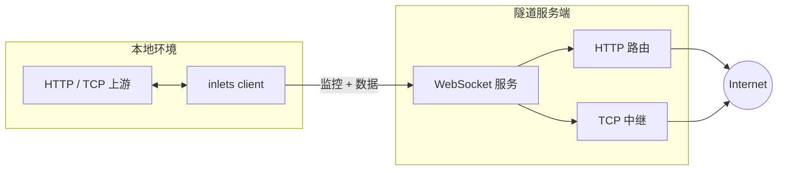

# 架构

概览：**客户端**与上游同机部署；**服务端**在公网终结 HTTP/TCP，经 **WebSocket**（及相关通道）将流量转发到客户端。

## 数据流

1. 客户端连接服务端并完成鉴权（**token** / **credentials** / **public** 监控）。
2. **HTTP**：服务端经隧道下发请求，客户端转发到本地上游并回写响应。
3. **TCP**：服务端接受公网连接并与客户端的上游拨号建立流。
4. **心跳**、**@@CONFIG** 等保持会话；断线后客户端重连。

## 控制面与数据面

- **监控通道**（`/_/monitor`）：鉴权、隧道生命周期、经典路径下 HTTP 封装与管理消息。
- **数据通道**（`/_/data`，v2）：协商开启时的二进制分帧高吞吐路径。

## 协议版本

- **v2**：能力协商（流式、HTTP 头体分帧、TCP over WebSocket 等）。
- **Legacy v1**：旧报文与端点。

### TCP 流（v2）

**TCP over WebSocket** 同时使用 **数据通道**（`/_/data`）与监控通道上的 **`tcp:connect`** 等消息。两条 WebSocket 互不保证时序，旧客户端可能在处理完 `tcp:connect` 之前就收到首包用户数据，从而丢弃首段字节（导致 TLS/代理握手失败）。

当前客户端会协商 **`TCPEarlyStreamRegister`**：在数据通道就绪时即注册流状态。服务端在协商到该能力时不做额外延迟；未声明该能力的老 v2 客户端仍兼容：服务端在启动上行转发前短暂等待，尽量让监控通道先处理 `tcp:connect`（尽力而为）。

相关测试：`internal/server/tunnel/tcp_relay_delay_test.go`、`internal/server/channels/monitor/capabilities_test.go`、`internal/client/capabilities_test.go`。

详见 [新协议说明](/zh/features/NEW_PROTOCOL_ISSUES)。

## 代码地图

| 路径 | 作用 |
| --- | --- |
| `cmd/inlets/` | CLI 入口 |
| `internal/client/` | 连接、HTTP/TCP、心跳 |
| `internal/server/` | 服务端核心、适配器、通道、隧道 |
| `internal/server/protocol/` | 协议 |
| `internal/server/tunnel/` | HTTP/TCP 隧道实现 |
